# Portfolio Website

## Table of Contents
- 🚀 [Project Overview](#project-overview)
- ✨ [Features](#features)
- 💻 [Technologies](#technologies)
- 📋 [Requirements](#requirements)
- 🛠️ [Setup Instructions](#setup-instructions)
- 📸 [Screenshots](#screenshots)

## Project Overview
A website created to present all of my projects. It also provides various forms of contact.
> [!NOTE]  
> Website is available in English language version!

## Features

- 🌐 2 language versions (Polish/English)
- 💻 Unique design of the “Projects” section in the mobile and desktop versions.
- 🖼️ Panel for each project, presenting a photo gallery, technologies used, description, and links
- 📱 Full responsiveness

## Technologies

**Frontend**
- Next.js
- React
- Tailwind CSS
- Framer Motion
- Lucide

## Requirements
Software versions used for development:
- Next.js 15.2.4
- React 19.1.0
> [!WARNING]  
> Compatibility with earlier versions has not been tested.

## Setup Instructions
To run a project locally, you must have Node.js and npm installed. 
> [!IMPORTANT]  
> *Download guide: [Installing Node.js and npm](https://docs.npmjs.com/downloading-and-installing-node-js-and-npm)*

1. Download and extract the "Portfolio" folder.
2. Navigate to the folder in your terminal.
3. Install dependencies and launch the app:
```
$ npm install
$ npm run dev
```
4. Access the application at [http://localhost:3000](http://localhost:3000).

## Screenshots
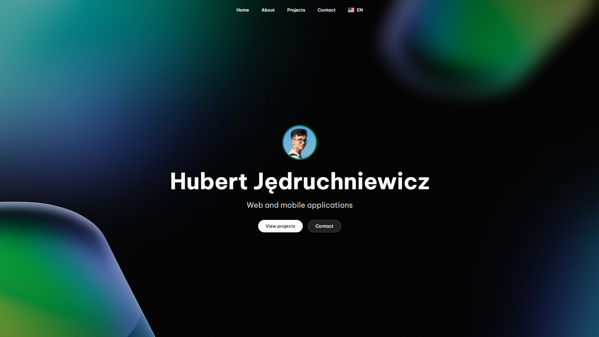
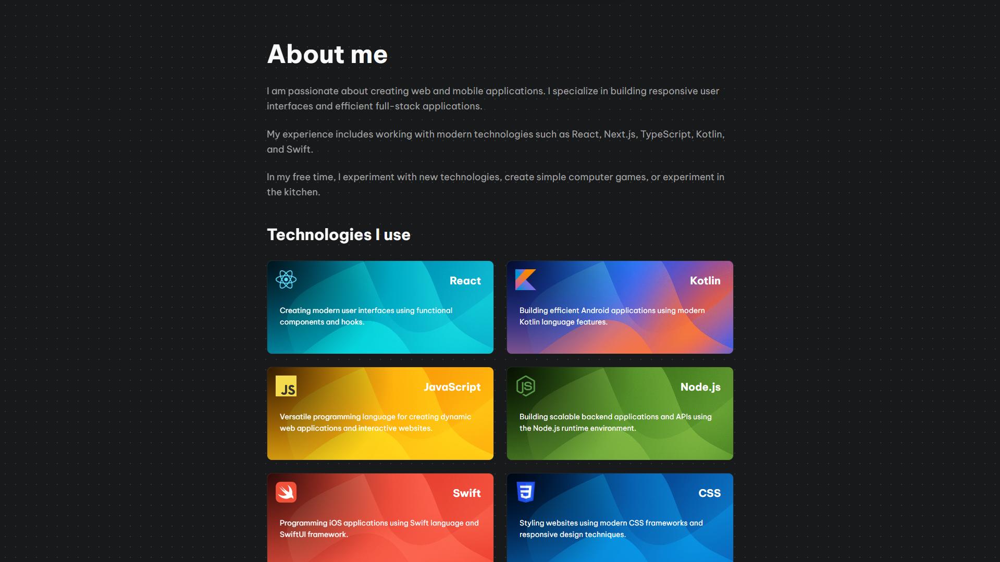
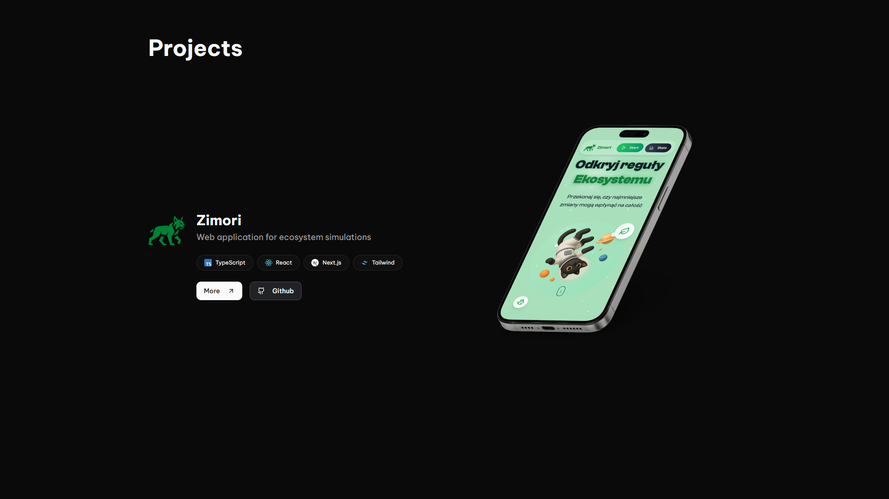
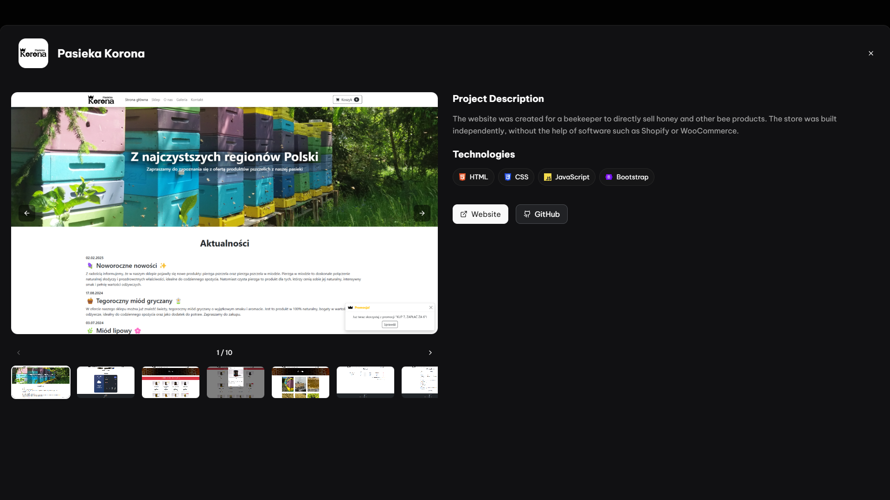
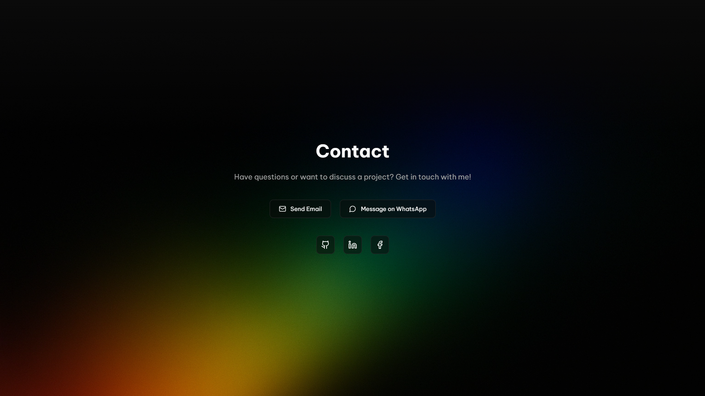

### Mobile Device
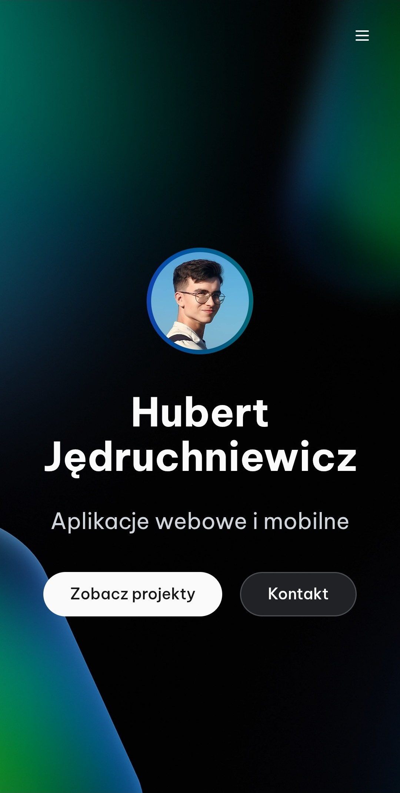 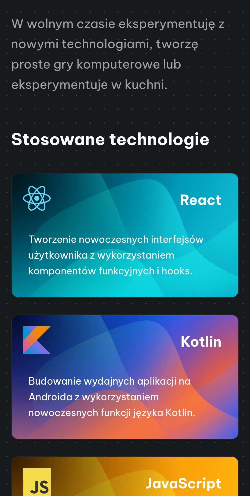
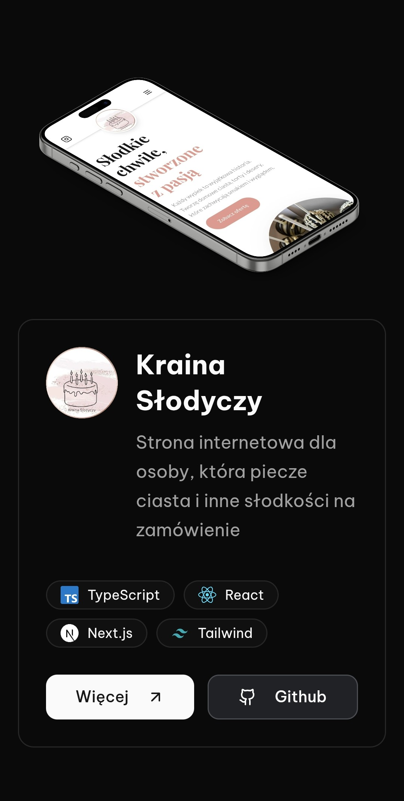 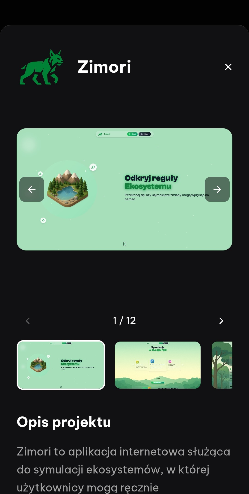
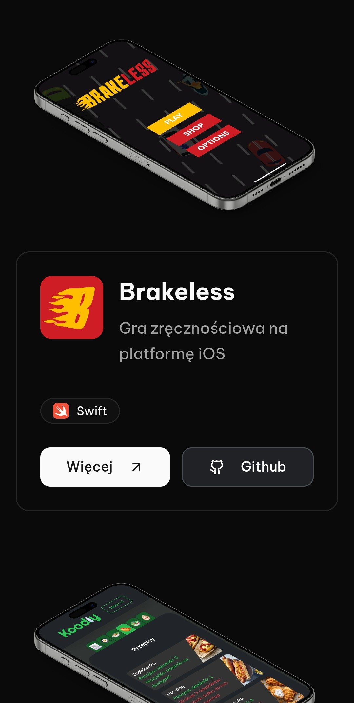 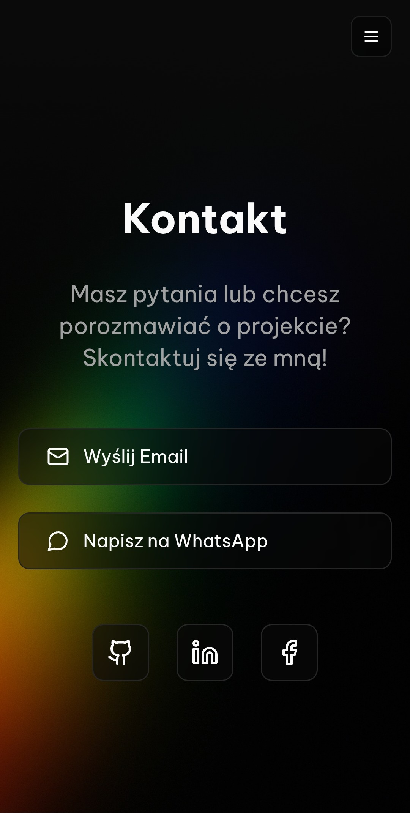
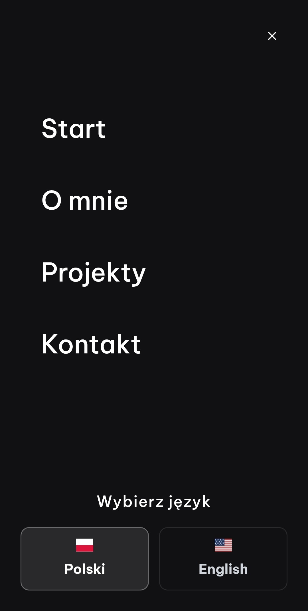
